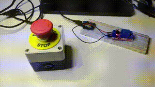
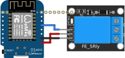
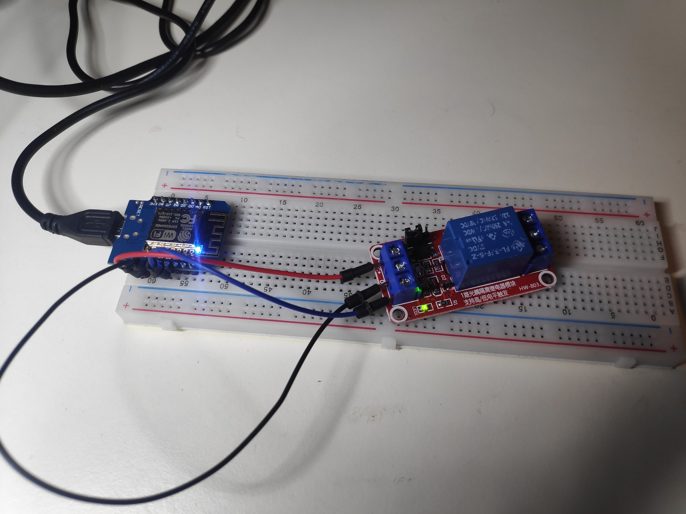
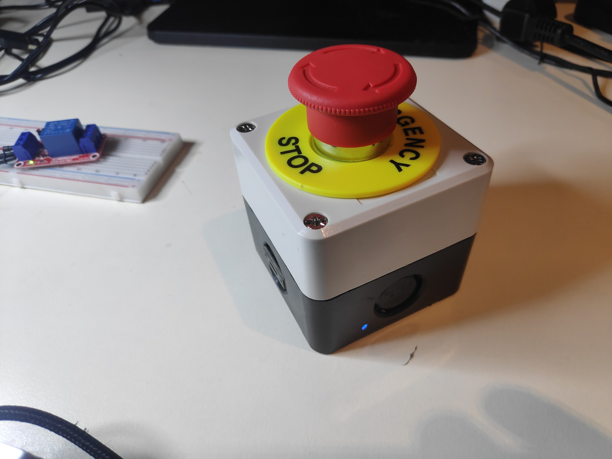
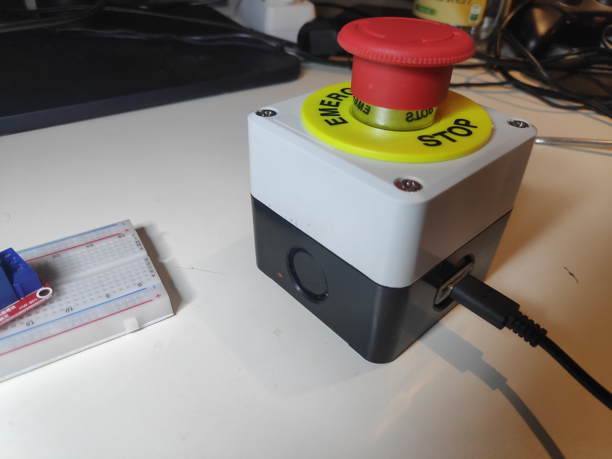
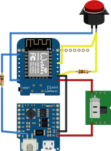
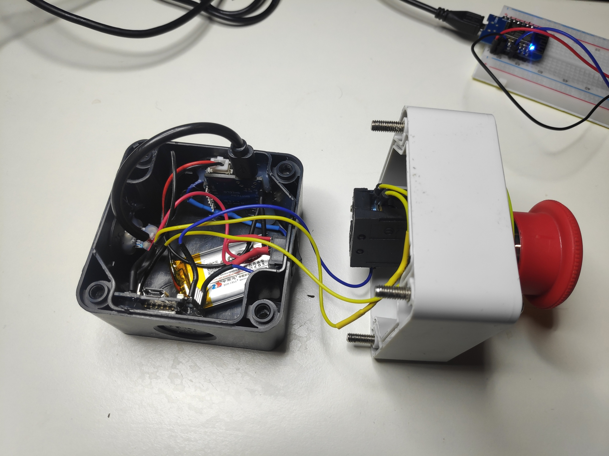

# wireless-estop

Wireless E-Stop connected to relay

This project realizes a wireless E-Stop. It will handle the state of the actual button and also handle connection losses. 

It can be wired to inputs of other systems or directly integrated into Arduino projects that support the ESPNOW! protocol. 

## ESP-NOW! Connection
The Button Station is a Wemos D1 Mini with an attached battery shield and a 1000mAh battery connected to it. Additionally a "Normally Closed" E-Stop button button is wired to the D2 input pin. 

The Base Station is also a Wemos D1 mini that is connected to a relay switch. The state of the E-Stop button is mirrored to the relay switch. 

The state of the button is sent to the master in a given frequency (every 20ms) via the ESP-NOW! protocol. 

There are two causes that can set the system to stopped state. 
 * The button is pressed (E-Stop Button connection is open)
 * The master does not receive a message within a given time frame (timeout)

If the master does not receive a message within a given time it will assume the connection is lost and switch to STOP state. 

## Building the Hardware
### Base Station
The base station is pretty simple and can be set up on a breadboard.
The base station can be pretty much anything. In the example the E-stop button state is mirrored to a relay. It should be wired 'normally closed' and when the E-Stop button is free (not pressed, D2 pin = HIGH) the connection of the relay is closed. 

*Schematics: Base station wired to relay*

*Base station wired to relay on breadboard*
 

### E-Stop Button Station
The E-Stop housing was bought as it is and modified by drilling and cutting the necessary holes into it. 

*Button pressed with blue LED on the side*

*Button charging via USB-C with red LED showing charging state*

The controller and the power shield have been hot glued to the left and right sides with the onboard LEDs pointing outwards. A hole was drilled into the shell where the LEDs are positioned. Due to hot glueing, the light of the LEDs is forwarded outside, so charging state and controller LED can be seen even if the box is closed. 

Additionally a cable that converts the V+ and GND of the Micro-USB port of the power shield to USB-C has been integrated as well. Thus, the Button can be charged via USB-C chargers. 

*Schematics: Button Station*

The button station is powered via the Wemos D1 battery shield connected to a 1000mAh lipo battery. It can be turned on or off via the main switch and charged through the battery shield. 

The E-Stop button itself is wired to the D2 pin as an input. 

*Inner wiring of the button*

## Building the Source
The projects can be built using Visual Studio Code with PlatformIO extension. 
You might have to adapt the upload_port and monitor_port in platformio.ini to match your serial connection. 

To load the project, just add the following folders to your workspace seperately: 
 - libestop (no need to build)
 - estopsrv (build and deploy to base station)
 - estopclient (build and deploy to your button)

### Configuration
In **common/config.h** the system can be configured. The cell id should be adapted to avoid issues with projects compiled in standard configuration. 